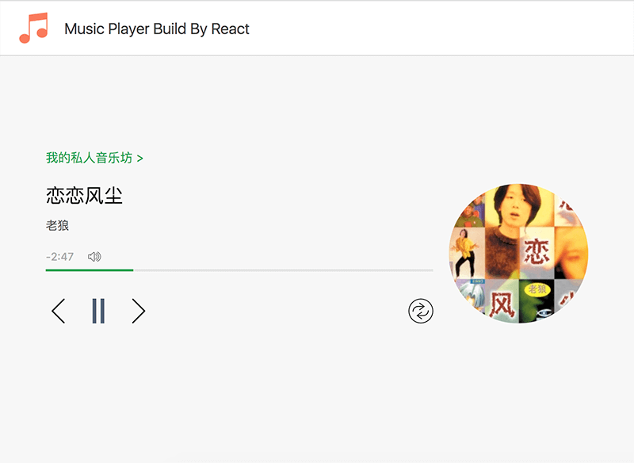
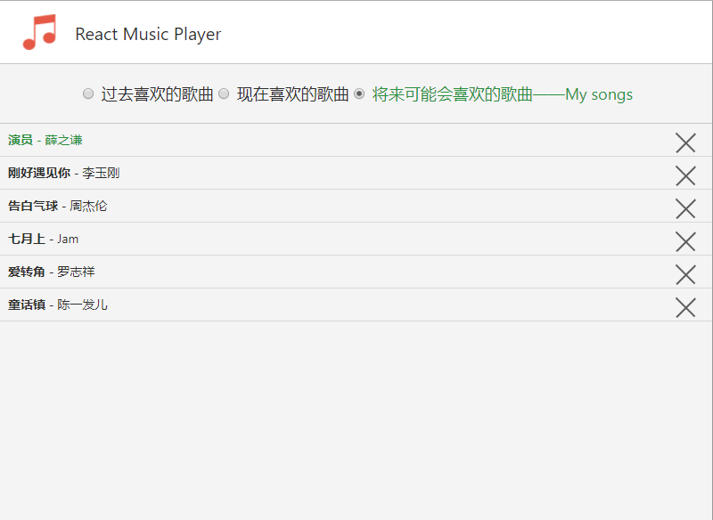

# react-music-player
music player build with React

### 改进

- npm run build 之后 static 文件夹没有被复制到 dist 文件夹的问题
- 支持三种时间线的歌单（告别过去、珍惜当下、拥抱未来）

### overview



### 如何运行

**开发启动**
```shell
npm start
```

**编译产品**
```shell
npm run build
```

**运行各阶段例子**

修改`webpack.config.js`中`entry`

比如`Router`例子
```javascript
entry: [
    'webpack-dev-server/client?http://localhost:3000',
    'webpack/hot/only-dev-server',
    'react-hot-loader/patch',
    path.join(__dirname, 'app/me/index.js')
],
```
